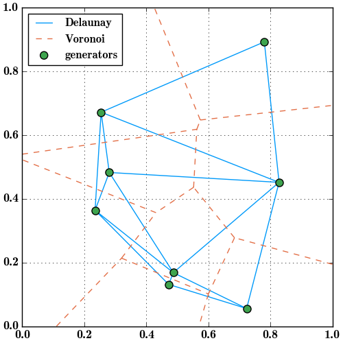

# Deldir

[](https://travis-ci.org/robertdj/Deldir.jl)

[deldir](https://cran.r-project.org/web/packages/deldir) is an R package for computing Delaunay triangulations and Voronoi/Dirichlet tesselations.
This Julia package wraps the Fortran code from deldir.


## Usage

The coordinates of the generators are specified as two vectors that are fed to `deldir`, the main function of this package:

```julia
x = rand(8)
y = rand(8)
D = deldir(x, y)
```

The output from `deldir` is a struct with three DataFrames, one for the topology of the Delaunay triangulation, one for topology of the Voronoi tesselation and a summary mainly related to the area of the triangles and Voronoi cells.

By default, `deldir` works with points in the unit rectangle, but other bounding rectangles can be specified as an optional argument.

The area of the Voronoi cells are also available directly with the function `voronoiarea`.

Two functions are available to extract the edges of the Delaunay triangles and Voronoi cells in a "plot friendly" manner:

```julia
Dx, Dy = delaunayedges(D)
Vx, Vy = voronoiedges(D)
```

Using the results from above this can be plotted with e.g. Winston:

```julia
using Winston
plot(x, y, "o")
oplot(Vx, Vy, "r--")
oplot(Dx, Dy)
```

One realization looks like the following.




## Installation

Install the package by running

```julia
Pkg.add("Deldir")
```

As mentioned, this package is a wrapper for a Fortran library and if this is not compiled automatically, you must run the `build.jl` script in the `deps` folder.

Compilation is performed with `gfortran` and I have only tested this on OS X Yosemite and Linux Mint with Julia v0.4.


## Motivation

This is not the only Julia package for Delaunay/Voronoi computations.
I am aware of the pure Julia implementation [VoronoiDelaunay](https://github.com/JuliaGeometry/VoronoiDelaunay.jl) and the Boost wrapper [Voronoi](https://github.com/Voxel8/Voronoi.jl).

However, Deldir has two qualities that I value:

- It interacts well with the bounding box.
- It returns the area of the Voronoi cells *in the same order as the input generators*.


## Limitations

Not all features of the R package are available.
I have e.g. chosen to ignore options regarding dummy points. 

Are you missing anything important? 
Check out the [manual](https://cran.r-project.org/web/packages/deldir/deldir.pdf) for the R package to see if the Fortran library supports it.


## Acknowledgement

[Rolf Turner](https://www.stat.auckland.ac.nz/~rolf) is author of the deldir package for R as well as all Fortran code in this package.


## License

The *Julia code* in this package is MIT licensed and the *Fortran code* is licensed under GPL.

